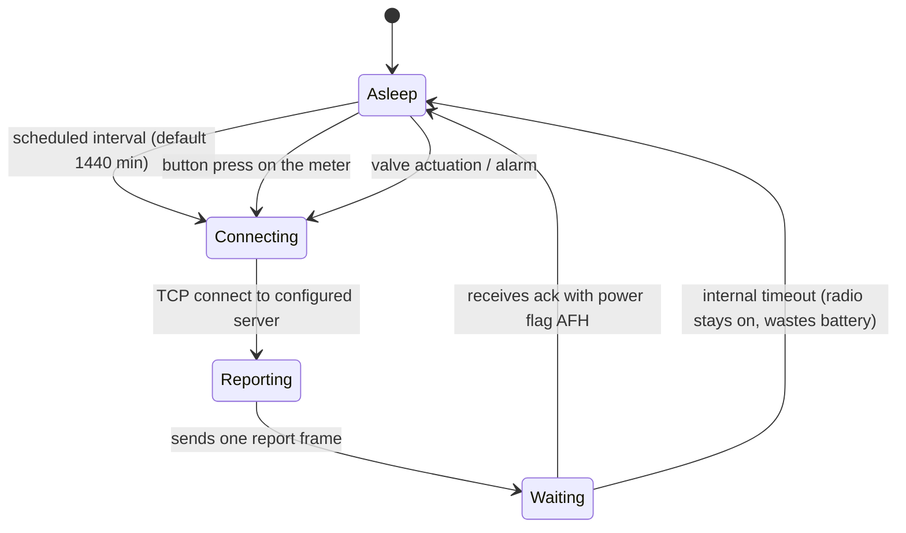
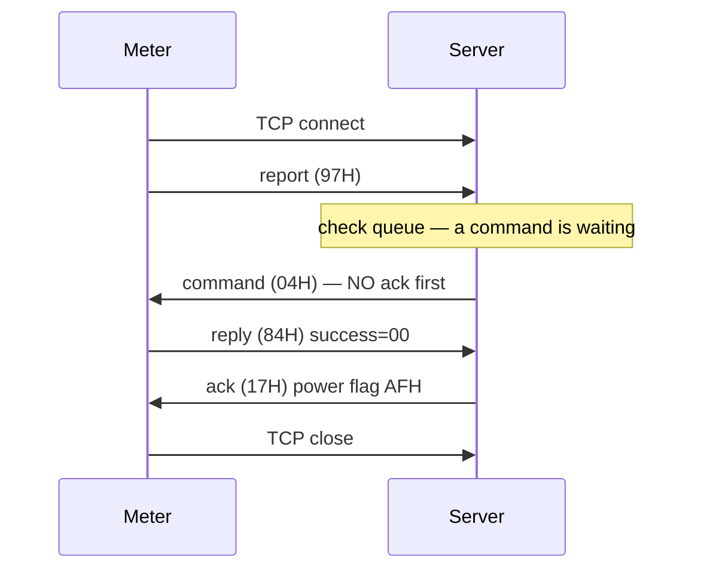
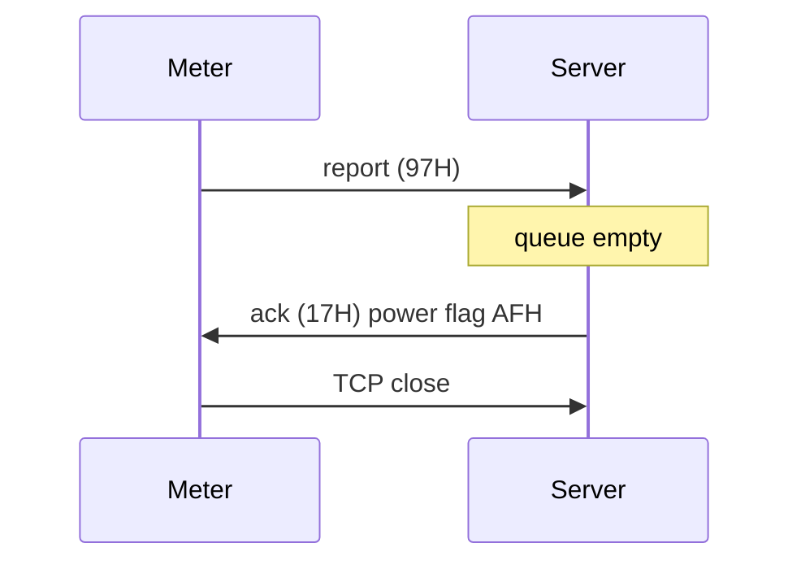
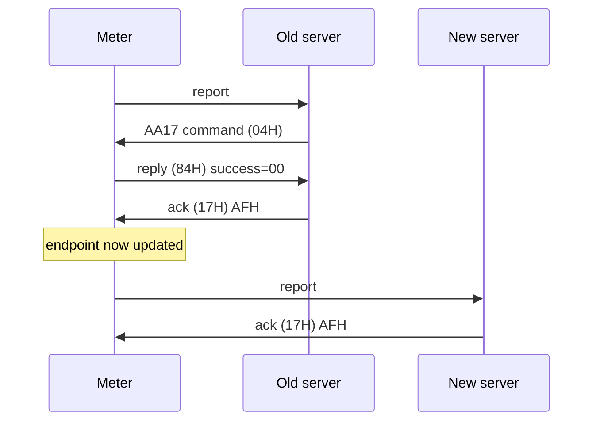

# CAT-1 Water Meter — Server Implementation Guide

How to build a server that ingests readings from, and sends commands to, a Shenzhen
Jia Ronghua CAT-1 remote water meter.

Examples throughout use meter `00102608220004` (hardware `0306`, software `0300`,
manufacturer `C22C`). Every frame shown is complete and checksum-correct — you can
send them as-is once you substitute your own meter address.

Follow the byte offsets and data lengths given here exactly.

---

## 1. How the device behaves

The single most important thing to understand: **the meter is a TCP client, not a
server.** It is battery powered and asleep almost all of the time. You cannot reach
out and poll it. It dials in, says what it has to say, and powers its radio down.



Consequences for your design:

- **Commands are queued, never delivered on demand.** The earliest a command can
  reach the meter is its next contact. Your API should return `202 Accepted`, not
  `200 OK` — you have recorded an intent, the device has not acted on it.
- **A contact is short.** Seconds. Everything you want to say must be said while the
  socket is open.
- **Always send the acknowledgement.** The meter holds its radio on until it gets
  one. Withholding it does not fail safe; it drains the battery on every report.

### Waking the meter

Three things cause a contact:

| Trigger | Reporting-type bit | Notes |
|---|---|---|
| Scheduled interval | `D0` timed | Default 1440 minutes (24 h) |
| **Button press on the meter** | `D1` trigger | A long press on the physical button. This is how you force a contact during development. |
| Valve actuation | `D3` valve_action | Set when the valve has moved since the last report |
| Card swipe | `D2` card_swipe | Prepaid meters only |
| Magnetic interference | `D4` | Tamper detection |

The reporting type is a bitfield at bytes 13–14 and several bits can be set at once —
`000A` means `trigger` + `valve_action` together.

> **Not characterised:** whether a short press behaves differently from a long press.
> Every contact forced during testing used a long press. If your installer
> documentation needs to distinguish them, test it rather than assuming.

Because the default schedule is 24 hours, **a queued command may sit for a day** before
it is delivered. During development, press the button. In production, consider
shortening the reporting interval.

---

## 2. Meter identity

Every meter has a **14-digit decimal address**. Always 14 digits — pad with leading
zeros, never trim. Example: `00102608220004`.

On the wire it occupies **7 bytes at offsets 2–8, BCD encoded, in reverse byte order**:

```
display form   0 0 1 0 2 6 0 8 2 2 0 0 0 4      (14 digits)
BCD pairs      00 10 26 08 22 00 04             (7 bytes)
on the wire    04 00 22 08 26 10 00             (reversed)
               ^^ offset 2                   ^^ offset 8
```

To decode: take bytes 2–8, reverse the byte order, render each byte as two decimal
digits. To encode: the same operation in reverse. Getting this backwards is the most
common first bug — the meter will simply ignore a command addressed to a meter that
does not exist, giving you silence rather than an error.

Validate incoming addresses as BCD. Any nibble above `9` means you are misreading the
frame, not that the meter has an unusual address.

---

## 3. Network: IP address and port

### Your server

- Listen for **raw TCP**. There is no HTTP, no MQTT, no framing library — the meter
  opens a socket and writes protocol bytes directly.
- A common mistake is pointing the meter at an HTTP server, which answers
  `400 Bad Request` and discards the data. There is no request line to parse.
- The reference implementation listens on `65.1.99.130:8505` and serves both raw TCP
  and an HTTP management API on the same port, by sniffing the first byte: `0x68` is
  a meter frame, anything else is HTTP. This is optional but convenient.

Practical socket settings:

```js
socket.setNoDelay(true);      // do not let Nagle merge your frames together
socket.setTimeout(120_000);   // meters vanish without closing; reap the socket
```

**Disabling Nagle is not optional.** If you write two frames in the same tick they can
be coalesced into a single TCP segment, and the meter behaves differently when frames
arrive glued together. Keep every frame in its own segment.

### Pointing the meter at your server

The meter stores two server addresses, parameters `0xAC0E` (primary) and `0xAC0F`
(secondary). Each is **6 bytes: a 4-byte IPv4 address followed by a 2-byte port,
high byte first.**

```
192.168.1.100 : 10086
C0   A8   01   64   27 66
```

Meters arrive pre-pointed at a server, normally set at commissioning. **It can also
be changed remotely, over the air, and has been** — but not by writing those
parameters, which this firmware refuses. Use the `AA17H` command in §12.

### Source addresses vary

The meter is on a cellular network behind carrier NAT. Its source IP and port change
on every single contact:

```
37.111.194.21:3169
37.111.213.123:45274
37.111.214.126:10185
```

**Never key anything on the source address.** Identify the meter by the 14-digit
address inside the frame, and only by that.

---

## 4. Frame format

Every frame in both directions shares one envelope.

| Offset | Length | Field | Notes |
|---|---|---|---|
| 0 | 1 | Start | Always `68H` |
| 1 | 1 | Meter type `T` | `10H` = cold water meter |
| 2–8 | 7 | Address | 14-digit BCD, reversed (§2) |
| 9 | 1 | Device type | `03H` |
| 10 | 1 | Control code | See below |
| 11–12 | 2 | Instruction number | `0000` for reports; big-endian |
| 13–14 | 2 | Reporting type / spare | Bitfield on reports, `0000` on commands |
| 15 | 1 | Data length `m` | Counts bytes 16 … 15+`m` |
| 16 … 15+`m` | `m` | Data field | Packet-specific |
| 15+`m`+1 | 1 | Checksum | See below |
| 15+`m`+2 | 1 | End | Always `16H` |

**Total frame length is always `16 + m + 2`.** Use this to validate every frame, and
to split a TCP stream that may deliver several frames in one read, or one frame across
several reads.

### Control codes

| Code | Meaning | Direction |
|---|---|---|
| `97H` | Meter reports data | meter → server |
| `17H` | Server acknowledges a report | server → meter |
| `04H` | Server writes | server → meter |
| `84H` | Meter's reply to a write | meter → server |
| `01H` | Server reads | server → meter |
| `81H` | Meter's reply to a read | meter → server |

### Checksum

Sum every byte from the start frame `68H` up to **but not including** the checksum
byte. Keep the low 8 bits.

```js
function checksum(frame) {
  let sum = 0;
  for (let i = 0; i < frame.length - 2; i++) sum = (sum + frame[i]) & 0xff;
  return sum;
}
```

Verify it on every inbound frame and reject mismatches. Compute it on every outbound
frame — a bad checksum is silently ignored, which looks identical to the meter being
asleep.

### Warning: two protocols share this envelope

CJ/T 188 meters use the same `68H … 16H` framing but put the **data length at byte
10**, where CAT-1 puts the control code. If you may receive both, dispatch before
decoding:

```js
const isCat1 = buf.length > 16
  && [0x01, 0x03].includes(buf[9])       // device type, or a mirrored one (see below)
  && [0x97, 0x81, 0x84].includes(buf[10]);
```

Reading a CAT-1 frame with the CJ/T 188 layout produces nonsense like *"L=151, so this
frame should be 164 bytes"* for an 88-byte frame.

**Byte 9 is mirrored, not validated.** If you send a command with byte 9 = `01H`, the
reply comes back with `01H`. Accept both `01H` and `03H` on inbound frames or you will
route real command replies into the wrong decoder. Always *send* `03H`.

---

## 5. Reading data — the input format

The meter sends **packet type 03, "postpaid standard meter report"**, 88 bytes,
`m = 46H` (70). The packet type is byte 16.

### Worked example

```
6810040022082610000397000000024603C22C002403060300867512079825846D
898604221525700097820E0EA7F915003F001CC005A0FFFFFF0000000008B20000
0000000000002608041537290000000000000000 88 16
```

| Offset | Len | Field | This example | Decoded |
|---|---|---|---|---|
| 0 | 1 | Start | `68` | |
| 1 | 1 | Meter type | `10` | cold water |
| 2–8 | 7 | Address | `04002208261000` | `00102608220004` |
| 9 | 1 | Device type | `03` | |
| 10 | 1 | Control | `97` | meter report |
| 11–12 | 2 | Instruction no. | `0000` | always 0 when reporting |
| 13–14 | 2 | Reporting type | `0002` | button press |
| 15 | 1 | Data length | `46` | 70 → 88-byte frame |
| 16 | 1 | Packet type | `03` | postpaid standard |
| 17–18 | 2 | Manufacturer code | `C22C` | |
| 19–20 | 2 | **Table type code** | `0024` | see below |
| 21–22 | 2 | Hardware version | `0306` | |
| 23–24 | 2 | Software version | `0300` | |
| 25–32 | 8 | IMEI | `867512079825846D` | 15 digits + pad nibble |
| 33–42 | 10 | ICCID | `89860422…9782` | 20 digits |
| 43–44 | 2 | Battery voltage | `0E0E` | 3598 mV = **3.598 V** |
| 45 | 1 | RSSI | `A7` | **−89 dBm** (signed) |
| 46 | 1 | RSRQ | `F9` | **−7 dB** (signed) |
| 47 | 1 | SNR | `15` | **21 dB** |
| 48–49 | 2 | Cumulative report count | `003F` | 63 |
| 50–51 | 2 | Daily report count | `001C` | 28 |
| 52–57 | 6 | Reporting mode | `C005A0FFFFFF` | every 1440 min |
| 58–59 | 2 | **Status word** | `0000` | valve open |
| 60–63 | 4 | **Cumulative usage** | `000008B2` | **2226 L** |
| 64–67 | 4 | Daily usage | `00000000` | 0 L |
| 68–71 | 4 | Monthly usage | `00000000` | 0 L |
| 72–77 | 6 | Real-time clock | `260804153729` | 2026-08-04 15:37:29 |
| 78–85 | 8 | Spare | zeros | |
| 86 | 1 | Checksum | `88` | |
| 87 | 1 | End | `16` | |

**All three usage figures are in litres**, as 4-byte big-endian integers. Divide by
1000 for m³ if you want to present it that way, but store the litres.

> Packet 03 arrives with `m = 70` and eight zero bytes of spare at 78–85. Size the
> frame from `m` rather than from a fixed constant, and tolerate the spare block.

### Status word (bytes 58–59)

| Bits | Meaning |
|---|---|
| `D1 D0` | Valve: `00` open · `01` closed · `11` abnormal |
| `D5` | Battery undervoltage |
| `D6` | Magnetic interference |
| `D7` | Cover opened |
| `D14` | Magnetic interference recorded |

This is the authoritative source of valve state. **Confirm every valve command against
the status word in the next report**, rather than trusting the command's success byte.

### Table type code (bytes 19–20) — the reading precision

This tells you how the meter counts, and it is the field that most often confuses
people looking at "frozen" readings.

| Bits | Meaning |
|---|---|
| `D1 D0` | Metering resolution: `00` 1 L · `01` 10 L · `10` 100 L · `11` 1000 L |
| `D2` | Valve type: `0` blocked turn · `1` switch |
| `D5 D4` | Payment: `00` prepaid · `01` pre-ladder · `10` postpaid · `11` HVAC valve |

`0024` = postpaid, switch valve, **1 L resolution**.

**A meter set to 1000 L only increments once a full cubic metre has passed.** A meter
running at 1000 L resolution under a light load looks completely broken — every usage
field sits unchanged, report after report. It is not broken. Check this field first.
Changing it is §9.

### Reporting mode (bytes 52–57)

Byte 0 selects the scheme; `C0` means "interval in minutes", with the interval as a
big-endian 16-bit value in bytes 1–2.

```
C0 05A0 FFFFFF   →   0x05A0 = 1440 minutes = once per day
```

Other schemes: `C1` specific days, `C2` specific hours, `C3` specific minutes.

---

## 6. Acknowledging a report

Every report must be answered. The reply is a fixed **20-byte** frame with control
`17H` and `m = 2`.

| Offset | Field | Value |
|---|---|---|
| 0 | Start | `68H` |
| 1 | Meter type | echo from the report |
| 2–8 | Address | echo from the report |
| 9 | Device type | `03H` |
| 10 | Control | `17H` |
| 11–12 | Instruction no. | `0000` |
| 13–14 | Reporting type | **echo from the report** |
| 15 | Data length | `02H` |
| 16 | Packet type | **echo from the report** |
| 17 | Power-off flag | `AFH` |
| 18 | Checksum | |
| 19 | End | `16H` |

Example, answering the report in §5:

```
6810040022082610000317000000020203AFAC16
```

### The power-off flag — read this carefully

There are two values:

- `AFH` — no further instructions; the meter powers down immediately.
- `00H` — instructions follow; the meter extends its wait.

**Always send `AFH`, and only after the exchange is finished.** Send a command by
writing it in place of the acknowledgement (§7), never by holding the meter awake
with `00H`.

---

## 7. Sending commands — the rules that actually work

These rules are simple but non-obvious. Follow all four; breaking any one of them
produces `0BH` errors that look like malformed frames but are not.

### The four rules

1. **Do not acknowledge before a command.** When something is queued, send the command
   *instead of* the acknowledgement, immediately after the report arrives.
2. **One command per contact.** Do not queue several and expect them to chain.
3. **Acknowledge with `AFH` after the reply**, to close the exchange and let the meter
   sleep.
4. **Stop after an error.** Once the meter returns a non-zero error it
   abandons the session; anything sent afterwards is refused too, and a perfectly good
   command gets marked failed for a fault that is not its own.

### The working exchange



### Nothing queued



### Instruction numbers

Bytes 11–12. Generated by the server, must not repeat, and the meter echoes the same
number in its reply — that is how you correlate a reply with the command that caused
it.

Build a fallback anyway: an error reply can carry instruction number `0000` and data
identifier `0000`. If the number matches nothing and exactly one command is outstanding
for that meter, attribute the reply to it. Without this, a rejected command sits at
"sent" forever and the caller never learns it failed.

### Reply format (control `84H`, 35 bytes)

| Offset | Field |
|---|---|
| 16–17 | Data identifier, echoed |
| 18 | **Success: `00H` = OK, non-zero = error code** |
| 19–24 | Meter's real-time clock, BCD |

```
68100400220826100003840001000011AA05 00 2608041626380000000000000000CA16
                                     ^^ success
```

Error code `0BH` is decimal 11, and shows on the meter's display as "Error 11".

**A silent command is not necessarily a failed command.** The clock write (§10) applies
correctly and sends no reply at all. Judge those by their effect in the next report,
never by the absence of a reply.

---

## 8. Command summary

| Command | Identifier | `m` | Frame size | Section |
|---|---|---|---|---|
| Valve open / close | `AA05` | `0CH` | 30 bytes | §11 |
| Metering resolution | `AA07` | `18H` | 42 bytes | §9 |
| Clock | `AA00` | `11H` | 35 bytes | §10 |
| Server address / port | `AA17` | `14H` | 38 bytes | §12 |

Every command that works on this firmware is an **`AA`-series identifier from section
2 of the protocol**. The generic parameter writes of section III — `AC0E`, `AC0F`,
`AC12` — are all refused with `0BH`, whatever they address. If you are looking for a
capability, look for its `AA` command; do not conclude it is absent because the
parameter write fails.

---

## 9. Command: set reading precision → 1 L

Data identifier **`AA07H`**, "setting the meter type".

This is the decimal-point / resolution setting. It is what you change when readings
look frozen at whole cubic metres.

| Offset | Len | Field | Value |
|---|---|---|---|
| 0–14 | 15 | Standard header, control `04H` | |
| 15 | 1 | Data length | **`18H`** |
| 16–17 | 2 | Data identifier | `AA07` |
| 18 | 1 | **Metering mode** | `50`=1 L · `60`=10 L · `70`=100 L · `80`=1000 L |
| 19 | 1 | Payment mode | `48`=postpaid · `59`=prepaid · `4A`=pre-step · `4E`=HVAC |
| 20 | 1 | In-place mode | `44`=blocked turn · `4B`=switch |
| 21 | 1 | Address-change gate | **keep `00`** (`C1` would rewrite the meter address) |
| 22–28 | 7 | New address | zeros |
| 29 | 1 | Manufacturer-change gate | **keep `00`** (`C3` would rewrite it) |
| 30–31 | 2 | New manufacturer | zeros |
| 32–39 | 8 | Spare | zeros |
| 40 | 1 | Checksum | |
| 41 | 1 | End | `16H` |

> **`m` is `18H` (24) for this command**, which puts the checksum at offset 40 and
> makes the frame 42 bytes. Do not shorten it.

### Example — set 1 L precision

```
68100400220826100003040001000018AA0750484B00000000000000000000000000000000000000 90 16
                                     ^^ 50 = 1 L
                                       ^^ 48 = postpaid (restated)
                                         ^^ 4B = switch (restated)
```

Successful reply, then confirmation in the next report:

```
reply    68100400220826100003840001000011AA07 00 …      success
report   … table type code 0025 → 0024 …                1 L applied
```

### Two warnings

**`AA07` writes all three modes at once.** There is no "leave unchanged" value, so a
resolution change necessarily re-asserts the payment mode and valve type. Read the
current values from the table type code first and restate them, or you will silently
convert a postpaid meter to prepaid.

**⚠️ `AA07` opens the valve.** A write that changes only the metering mode will move
a closed valve to open, and the meter sets its own `valve_action` bit when it happens.
Re-asserting the payment mode makes the firmware re-evaluate the valve and open it on a
meter with no debt. Plan for this on every resolution change.

> If the valve must stay shut, queue an `AA05` close for the next contact and verify
> the status word. Never treat a resolution change as a read-only operation.

Changing resolution does **not** destroy the counter. A meter reading 2180 L showed
2000 L at 1000 L resolution and 2226 L after returning to 1 L — the underlying total
was preserved throughout; only the reported granularity changed.

---

## 10. Command: set clock → Dhaka time

Data identifier **`AA00H`**.

| Offset | Len | Field | Value |
|---|---|---|---|
| 0–14 | 15 | Standard header, control `04H` | |
| 15 | 1 | Data length | `11H` |
| 16–17 | 2 | Data identifier | `AA00` |
| 18 | 1 | Calibration enable | **`5AH`** — anything else leaves the clock alone |
| 19–24 | 6 | Clock, BCD | `YY MM DD HH MM SS` |
| 25–32 | 8 | Spare | zeros |
| 33 | 1 | Checksum | |
| 34 | 1 | End | `16H` |

### Example — set Dhaka time (UTC+6)

Sent at `2026-08-04T09:34:06Z`, which is `15:34:06` in Dhaka:

```
68100400220826100003040001000011AA00 5A 260804153406 00000000000000007A16
                                     ^^ enable
                                        ^^^^^^^^^^^^ 26-08-04 15:34:06
```

Result, three minutes later:

```
received 09:37:29 UTC   meter clock 15:37:29   → offset exactly +6:00:00 ✓
```

### Three critical behaviours

1. **`AA00` never replies.** No `84H`, nothing. The contact contains one inbound frame
   and your ack. The command will sit at "sent" in your queue forever — build a
   timeout, and judge success by the clock in the next report.
2. **It must be sent alone, first in the session.** An attempt chained second behind
   another successful command did nothing at all. This is the single difference between
   the attempt that failed and the one that worked.
3. **The meter has no concept of time zones.** It stores exactly the six digits you
   send and reports them back unchanged. *You* decide what wall clock those digits
   represent. To display Dhaka time, send Dhaka digits.

Resolve the timestamp **at delivery, not at queue time.** A meter on the daily schedule
may collect its command 24 hours later; freezing the time when the request arrived sets
the clock exactly as wrong as the delay.

```js
const parts = new Intl.DateTimeFormat('en-GB', {
  timeZone: 'Asia/Dhaka',
  year: '2-digit', month: '2-digit', day: '2-digit',
  hour: '2-digit', minute: '2-digit', second: '2-digit',
  hourCycle: 'h23',   // 00-23, so midnight is 00 rather than 24
}).formatToParts(new Date());
```

Use an IANA zone name rather than a fixed `+6` offset, so a region that starts observing
DST keeps working. Dhaka is UTC+6 today but did run DST in 2009.

**Meters ship set to UTC+8.** Until you set the clock, every
timestamp you ingest is China time, regardless of where the meter physically is.

---

## 11. Command: valve open / close

Data identifier **`AA05H`**. This physically actuates a motorised valve and cuts a
water supply. Treat it accordingly.

| Offset | Len | Field | Value |
|---|---|---|---|
| 0–14 | 15 | Standard header, control `04H` | |
| 15 | 1 | Data length | `0CH` |
| 16–17 | 2 | Data identifier | `AA05` |
| 18 | 1 | **Operation** | `55H` = open · `99H` = close |
| 19 | 1 | Permission | `5AH` = forced · anything else = advisory |
| 20–27 | 8 | Spare | zeros |
| 28 | 1 | Checksum | |
| 29 | 1 | End | `16H` |

### Examples

```
close   6810040022082610000304000100000CAA05 99 0000000000000000003816
open    6810040022082610000304000100000CAA05 55 000000000000000000F416
```

Both are 30 bytes. Use them as fixtures when testing your encoder — if your builder
produces these byte for byte, the frame is correct.

### Notes

- **Advisory works.** Forcing (`5AH`) is not required — both directions have been
  actuated successfully with the permission byte at `00H`. Do not force by default;
  forcing a valve should never be implicit.
- **Require the state explicitly in your API.** Do not default it. Shutting off a
  water supply is not something to arrive at by omission.
- **Confirm via the status word**, not the success byte. The next report shows
  `valve closed` / `valve open` and sets the `valve_action` reporting bit.
- The meter's display may flash a transient error code after a successful actuation.
  Ignore it and read the status word in the next report — that is the authoritative
  valve state.

## 12. Command: change the server address and port

Data identifier **`AA17H`**, protocol section 2.12 *服务器地址端口修改*.

This moves a meter from one server to another over the air. It is the most consequential
command in this document: get it right and you can migrate a fleet without touching the
hardware; get it wrong and the meter is gone for good.

### Why not the parameter write

The obvious approach — writing parameter `0xAC0E` with the 6-byte endpoint from §3 —
**does not work on this firmware.** It comes back `0BH` with the instruction number and
identifier echoed intact, exactly like any other section III parameter write. The frame
is fine; the identifier is the problem.

`AA17H` carries the same payload as a section 2 command, and is accepted. This was
confirmed as a clean A/B: `AC0E` refused `0BH`, then `AA17H` accepted `00H` minutes
later, same endpoint, same meter.

> `AA17H` may be missing from your copy of the protocol PDF. Revisions exist whose
> section 2 ends at 2.10, and this command is 2.12. If a capability seems absent, get
> the current revision from the vendor before designing around its absence.

### Frame layout — 38 bytes, `m = 14H` (20)

| Offset | Len | Field | Value |
|---|---|---|---|
| 0–14 | 15 | Standard header, control `04H` | |
| 15 | 1 | Data length | **`14H`** (20 decimal) |
| 16–17 | 2 | Data identifier | `AA17` |
| 18–19 | 2 | Modification enable | **`A6B6`** — anything else leaves the endpoint alone |
| 20–21 | 2 | **Confirmation word** | low two bytes of the meter address XOR `A6B6` |
| 22–25 | 4 | New IPv4 address | high byte first |
| 26–27 | 2 | New port | high byte first |
| 28–35 | 8 | Spare | zeros |
| 36 | 1 | Checksum | |
| 37 | 1 | End | `16H` |

The confirmation word is a safety interlock. The meter only accepts the frame if the
word matches the address it knows itself by, so a broadcast or a mistyped address
cannot re-point a fleet by accident.

**Compute it in value order**, not wire order: take the address's two least significant
BCD bytes as they read, high byte first, and XOR with `A6B6`.

```
address        00102608220004
BCD pairs      00 10 26 08 22 00 04
low two bytes  00 04            ← value order, NOT the wire order 04 00
confirm        0x0004 ^ 0xA6B6 = 0xA6B2
```

The specification sentence — 表地址低两字节分别与A6B6异或 — does not settle the byte
order, and the two readings sum identically, so **no checksum can tell them apart.**
A meter with the opposite convention would refuse `0BH` while everything else about
the frame is correct. If that happens, flip to wire order (`0xA2B6` for this address)
before you go looking for a deeper problem.

### Worked example — move to 65.2.232.159:8505

```
68100400220826100003040002000014AA17A6B6A6B24102E89F213900000000000000009216
                              ^^ m = 14H
                                ^^^^ AA17
                                    ^^^^ A6B6 enable
                                        ^^^^ A6B2 confirm (address 00102608220004)
                                            ^^^^^^^^ 41 02 E8 9F = 65.2.232.159
                                                    ^^^^ 2139 = 8505
```

Reply, 35 bytes, the standard `84H` form from §7:

```
68100400220826100003840002000011AA17 00 2608051922310000000000000000D616
                                     ^^ success
```

### What to expect

**1. The move happens after the current session, not during it.** The report that
carried the command still completes on the old server — ack and all. The meter switches
for its *next* contact.



Observed exactly this way: report #70 on the old server, report #71 on the new one,
counters continuous, same IMEI and ICCID, cumulative usage unchanged. **So a meter's
command-carrying contact always lands on the old server, and you only learn the move
succeeded one contact later.** Build your migration tracking around that.

**2. There is no readback.** The `01H` read is refused on this firmware, so you cannot
ask a meter which server it currently points at. The only confirmation is that it turns
up. Record the intended endpoint yourself, at the moment you queue the command.

**3. Success `00H` means the frame was accepted, not that the meter has moved.** It is
necessary, not sufficient. A no-op write — sending the address the meter already has —
returns exactly the same `00H`.

**4. `0BH` is safe.** A refusal leaves the meter where it was. Nothing is lost and you
can try again with a different confirmation byte order.

### ⚠️ The failure mode: permanent loss

**Downlink rides on the acknowledgement path.** The meter is a TCP client (§1) — the
only moment you can send it anything is while it is connected, having just reported.
A meter pointed at a server that never acknowledges reports can never be commanded
again, including to send it back.

There is no remote recovery. No timeout, no fallback to the secondary address, no
factory reset over the air. Someone visits the meter with a cable.

So, before you point a single meter at an endpoint:

- [ ] The destination is listening on **raw TCP** at that exact IP and port
- [ ] It answers a real report with a byte-correct `17H` ack (§6) — replay a captured
      frame and compare the response byte for byte, do not assume
- [ ] It answers frames it *cannot* decode, rather than dropping them
- [ ] Its firewall and security group admit the meter's carrier IP range, not just yours
- [ ] It stays up. A destination that is merely correct when tested is not enough

"It accepted a TCP connection" is not evidence. A server that accepts the socket and
never acks will swallow the meter just as completely as one that is switched off.

> Verify the whole path on **one** meter and confirm it reports before migrating the
> rest. A scripted fleet migration to a bad endpoint loses the entire fleet in one pass,
> and every meter fails identically and silently.

### Migrating between two servers you control

The safe shape, and the one that was actually used:

1. Stand the new server up and prove the ack (checklist above).
2. Turn **off** any auto-configure policy on the new server. A fresh server has no
   history for a meter that arrives, so its policy fires on the very first contact —
   and on this firmware that could mean `AA07`, which opens the valve (§9). Let the
   meter arrive, be acknowledged, and nothing else.
3. Queue the `AA17` on the **old** server. That is where the meter still reports.
   If that server runs an auto-configure policy that outranks hand-issued
   commands, check it has no outstanding work for this meter first — otherwise
   the `AA17` waits behind it, and a clock write in particular consumes the whole
   contact because `AA00` never replies (§10).
4. Force a contact (button press) and confirm `84H` success `00H`.
5. Force a second contact and confirm the report arrives on the new server.
6. Only then re-enable policy on the new server.

Keeping both endpoints under your control matters: if the meter lands on the new server,
you can send it home the same way. Re-pointing to a third party's server is a one-way
door unless you have watched their ack with your own packet capture.

---

## 13. Implementation checklist

**Ingest**

- [ ] Raw TCP listener, not HTTP
- [ ] `setNoDelay(true)` and an idle timeout
- [ ] Frame splitter using `16 + m + 2`; handle several frames per read, and frames split across reads
- [ ] Verify the checksum; reject and log mismatches
- [x] Dispatch on bytes 9 and 10 before decoding; anything not CAT-1 is logged raw, not guessed at
- [ ] Accept byte 9 of `01H` **or** `03H` on inbound frames
- [ ] Identify meters by the 14-digit address, never by source IP
- [ ] Log every frame raw, including ones you cannot decode

**Acknowledge**

- [ ] Answer every report
- [ ] Echo the reporting type and packet type
- [ ] Power flag always `AFH`, never `00H`
- [ ] Answer even a packet type you cannot decode — silence costs battery

**Commands**

- [ ] Queue with a TTL; return `202`, not `200`
- [ ] One command per contact
- [ ] Command instead of the ack; ack `AFH` after the reply
- [ ] Unique, non-repeating instruction numbers, plus a single-outstanding fallback
- [ ] Stop the queue on the first error rather than chaining
- [ ] A delivery timeout, so silent commands like `AA00` do not sit at "sent" forever
- [ ] Confirm effects in the next report, not from the success byte

**Operational**

- [ ] Authenticate the command API. It opens valves, and it re-points meters — one
      unauthenticated POST can put a meter permanently out of reach (§12)
- [ ] Persist the queue and readings if they must survive a restart
- [ ] Record which time zone a meter's clock is set to; before it is set, it is UTC+8
- [ ] Record the endpoint you last sent each meter, at queue time — the meter cannot
      be asked where it points
- [ ] Prove any new destination acks a real report before re-pointing anything at it
- [ ] Migrate one meter and wait for it to arrive before migrating the rest

---

## 14. Reference frames

Meter address `00102608220004`, instruction number `0001`.

```
report (in)        6810040022082610000397000000024603C22C002403060300
                   867512079825846D898604221525700097820E0EA7F915003F
                   001CC005A0FFFFFF0000000008B20000000000000000260804
                   1537290000000000000000 8816

ack (out)          6810040022082610000317000000020203AFAC16

valve close (out)  6810040022082610000304000100000CAA05990000000000000000003816
valve open  (out)  6810040022082610000304000100000CAA0555000000000000000000F416

precision 1 L      68100400220826100003040001000018AA0750484B0000000000
                   00000000000000000000000000009016
precision 10 L     68100400220826100003040001000018AA0760484B0000000000
                   0000000000000000000000000000A016

clock (out)        68100400220826100003040001000011AA005A26080415340600
                   000000000000007A16

server → 65.1.99.130:8505       (instr 0001)
                   68100400220826100003040001000014AA17A6B6A6B241016382
                   21390000000000000000EE16
server → 65.2.232.159:8505      (instr 0002)
                   68100400220826100003040002000014AA17A6B6A6B24102E89F
                   213900000000000000009216
AA17 reply (in)    68100400220826100003840002000011AA17002608051922310000000000000000D616

success reply (in) 68100400220826100003840001000011AA05002608041626380000000000000000CA16
error reply (in)   68100400220826100003840003000011A9010B26080416545900000000000000002116
```

Both `AA17` frames carry the same confirmation word `A6B2`, because that is derived from
the meter address and does not change with the endpoint. Only the four IP bytes, the
instruction number and the checksum differ between them — a useful pair for testing an
encoder, since a byte-order bug in the IP field shows up immediately as a mismatch.
